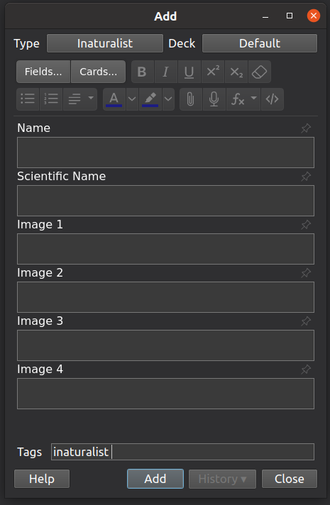

# Inaturalist to Anki scraper

This script is not designed to help you launch your inaturalist competitor:
it's a simple script for downloading a small amount of animal information and
adding it to Anki through
[Anki-Connect](https://github.com/FooSoft/anki-connect/).

## Installation

1. Clone this repo
1. `pip install -r requirements.txt`
1. Install [Anki-Connect](https://github.com/FooSoft/anki-connect/)

## Generating notes

1. Launch Anki with Anki-Connect running
1. Find either a `/taxa` or `/observation` page like to download
1. Run script to automatically create model and notes
    ```sh
    python run.py 'https://www.inaturalist.org/observations?iconic_taxa=Fungi&place_id=2&subview=table&view=species'
    ```


